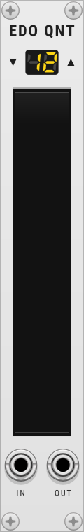
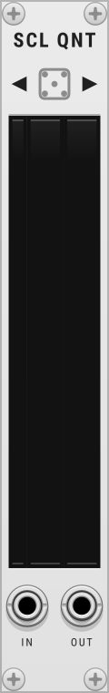
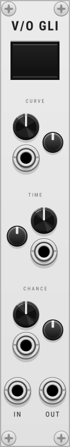

My personal plugins for [VCV Rack](https://vcvrack.com/).

## Modules

### EDO Quantizer

  
Show module

  

    
  

Quantizer with a selectable number of tones per octave (EDO — Equal Division of the Octave).

- `▼ 12 ▲` counter — sets the number of tones per octave (1 to 48).
- Tone strip display — the scale: click a tone to toggle it, drag to paint a row.
  Yellow — currently playing, amber — enabled, gray — disabled.
- `IN` — 1 V/octave input, `OUT` — quantized 1 V/octave output. Polyphonic.
- State (EDO and scale) is saved with the patch; context menu — enable/disable all notes.

---

### SCL QNT

  
Show module

  

    
  

Quantizer that loads random Scala `.scl` scales from the bundled `scl/` folder.

- `<` / `>` navigation — walk through the history of loaded scales; pressing `>`
  past the end loads a new random scale.
- The scale name is shown vertically on the display.
- The scale history is saved with the patch.
- `IN` — 1 V/octave input, `OUT` — quantized 1 V/octave output. Polyphonic.

---

### V/O GLI

  
Show module

  

    
  

Pitch glider: on each pitch change it glides from the previous pitch to the new one.

- `TIME` — glide duration in seconds (0.01 to 5).
- `CURVE` — glide character: exponential, linear or logarithmic; the curve
  preview on the display follows the knob.
- `CHANCE` — probability that the glide triggers instead of jumping (0 to 100%).
- `CV` for each knob - for controlling the module parameters, an incoming signal (envelope, LFO, anything).
  At full depth a ±10 V signal sweeps the entire range of the control.
- `IN` — 1 V/octave input, `OUT` — glided 1 V/octave output. Polyphonic.

## License

GPL-3.0-or-later
